# Agenda 8 - CRUD de Amigos

Projeto desenvolvido para a **Agenda 8 de Desenvolvimento de Sistemas II**.

O objetivo foi desenvolver um sistema web simples para cadastro de amigos, utilizando **PHP e MySQL**, aplicando as quatro operações básicas de um CRUD e um sistema de autenticação por login.

---

## Funcionalidades

O sistema permite:

- Realizar login
- Manter o usuário autenticado através de sessão
- Visualizar os amigos cadastrados
- Cadastrar novos amigos
- Editar registros existentes
- Excluir amigos cadastrados
- Realizar logout
- Armazenar a senha utilizando hash
- Utilizar Prepared Statements nas consultas que recebem dados do usuário

---

## O que é CRUD?

CRUD representa as quatro operações básicas realizadas em registros de um banco de dados:

| Operação | Significado | Implementação |
|---|---|---|
| Create | Criar | Cadastro de um novo amigo |
| Read | Ler | Listagem dos amigos |
| Update | Atualizar | Edição dos dados |
| Delete | Excluir | Exclusão de um registro |

---

## Tecnologias utilizadas

- PHP
- MySQL
- SQL
- HTML
- CSS
- MySQL Workbench
- Git
- GitHub

---

## Estrutura do projeto

```text
agenda8-crud-amigos/
├── README.md
├── banco.sql
├── conexao.php
├── login.php
├── logout.php
├── index.php
├── cadastrar.php
├── editar.php
├── excluir.php
├── style.css
└── prints/
```

---

# Desenvolvimento

## 1. Banco de dados

Foi criado o banco:

```sql
gabi_crud
```

com duas tabelas:

### amigos

Responsável pelos dados utilizados no CRUD:

```text
id
nome
telefone
email
```

### usuarios

Responsável pelos dados utilizados no login:

```text
id
usuario
senha
```

A criação inicial do banco e da tabela de amigos foi realizada através do MySQL Workbench.

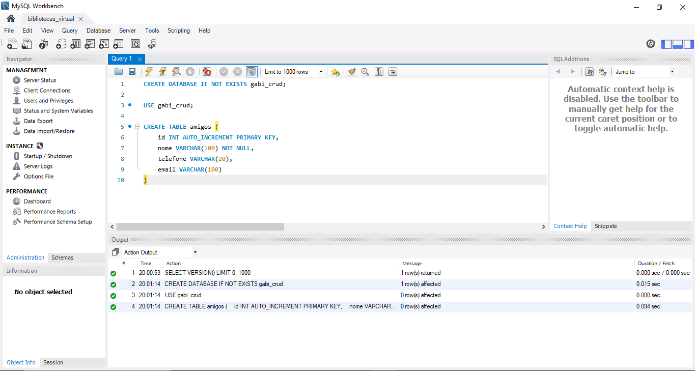

---

## 2. Conexão entre PHP e MySQL

A conexão é realizada através do arquivo `conexao.php`, utilizando a classe `mysqli`.

```php
$conexao = new mysqli(
    $servidor,
    $usuario,
    $senha,
    $banco
);
```

Durante os primeiros testes, foi verificado se o PHP conseguia se comunicar corretamente com o banco.

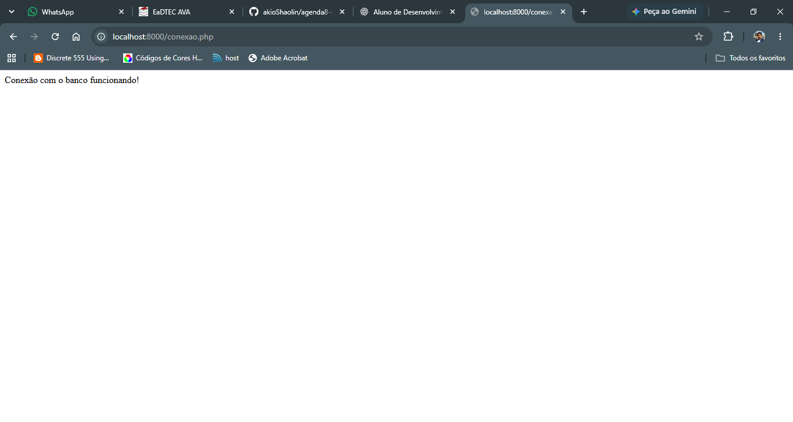

> A senha utilizada no ambiente local não é armazenada no repositório.

---

# CRUD

## Create - Cadastro

O arquivo `cadastrar.php` possui um formulário que recebe nome, telefone e e-mail.

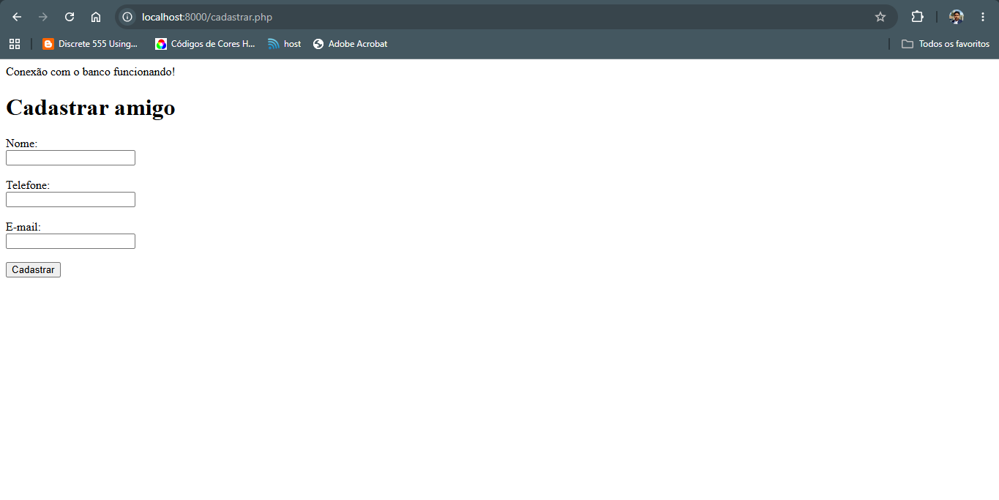

Ao enviar o formulário, os dados são inseridos no MySQL utilizando um Prepared Statement:

```php
$sql = "
    INSERT INTO amigos (nome, telefone, email)
    VALUES (?, ?, ?)
";

$stmt = $conexao->prepare($sql);
$stmt->bind_param("sss", $nome, $telefone, $email);
$stmt->execute();
```

Após o cadastro, foi possível verificar o registro diretamente no banco:

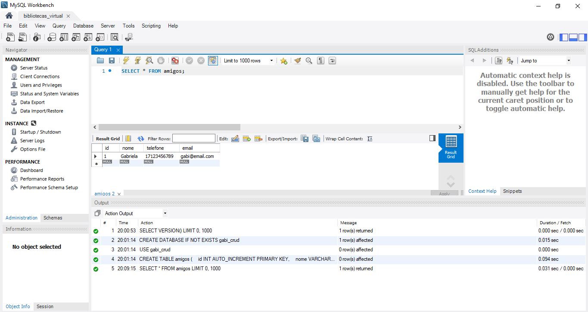

---

## Read - Consulta

O arquivo `index.php` consulta os registros da tabela `amigos` e apresenta os dados em uma tabela HTML.

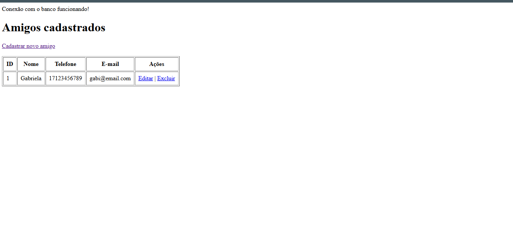

A consulta utilizada é:

```php
SELECT id, nome, telefone, email
FROM amigos
ORDER BY nome
```

---

## Update - Edição

Cada registro possui a opção **Editar**.

Ao selecionar essa opção, o sistema carrega os dados existentes no formulário:

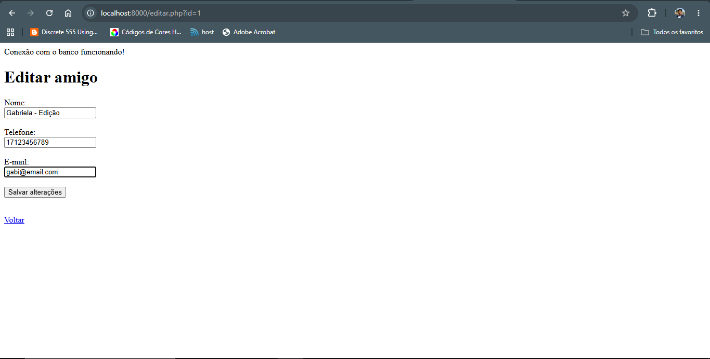

Depois de salvar, o registro é atualizado no banco:

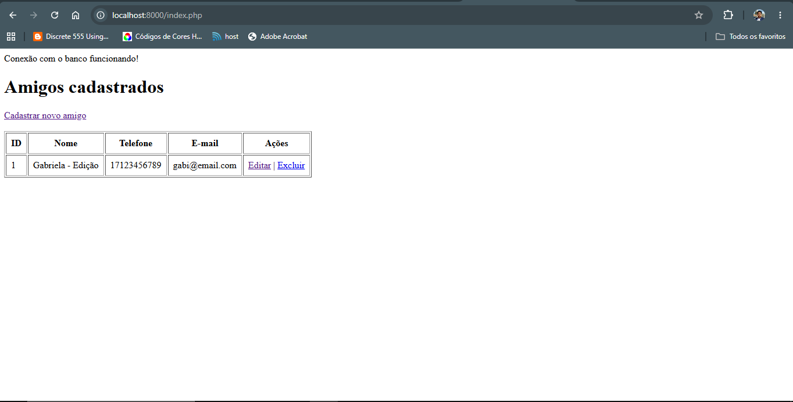

A atualização também utiliza Prepared Statement:

```php
$sql = "
    UPDATE amigos
    SET nome = ?, telefone = ?, email = ?
    WHERE id = ?
";
```

---

## Delete - Exclusão

Para testar a exclusão, foi criado um segundo registro:

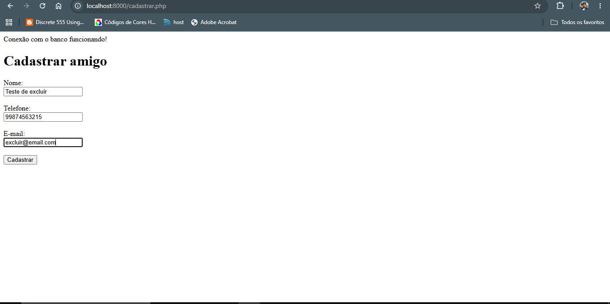

Os dois registros apareceram na tela principal:

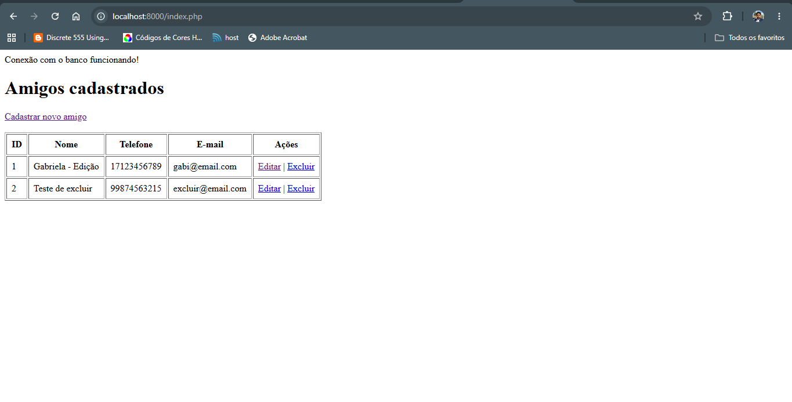

Ao selecionar **Excluir**, o navegador solicita confirmação:

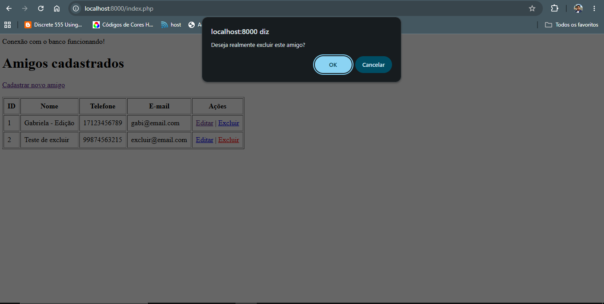

Depois da confirmação, o registro é removido:

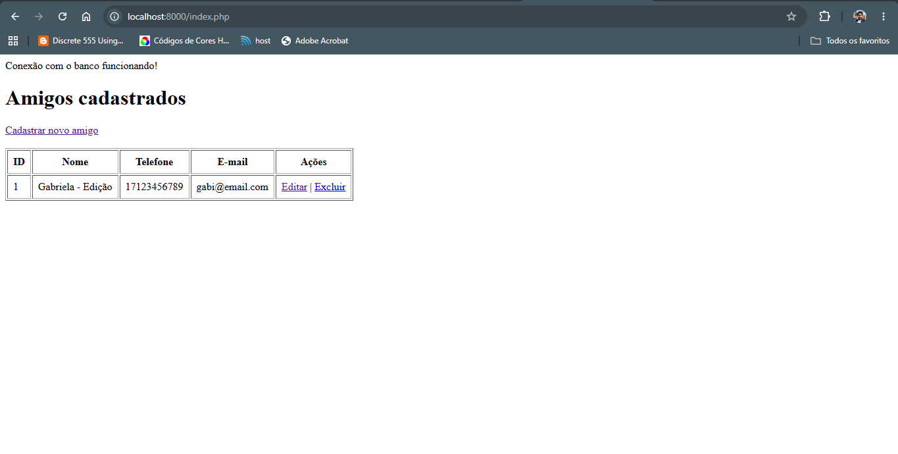

A exclusão também utiliza Prepared Statement:

```php
$sql = "DELETE FROM amigos WHERE id = ?";

$stmt = $conexao->prepare($sql);
$stmt->bind_param("i", $id);
$stmt->execute();
```

---

# Login e autenticação

Além do CRUD, foi implementado um sistema de login.

O sistema utiliza a tabela `usuarios` para armazenar os usuários autorizados.

A senha não é armazenada diretamente.

Para gerar o hash foi utilizada:

```php
password_hash($senha, PASSWORD_DEFAULT);
```

O resultado armazenado no banco possui aparência semelhante a:

```text
$2y$10$...
```

Durante o login, o PHP utiliza:

```php
password_verify($senha, $dados["senha"])
```

para comparar a senha digitada com o hash armazenado.

---

## Sessão

Quando o login é realizado corretamente, o sistema cria uma sessão:

```php
$_SESSION["usuario_id"]
$_SESSION["usuario"]
```

As páginas do CRUD verificam essa sessão antes de permitir o acesso.

```php
if (!isset($_SESSION["usuario"])) {
    header("Location: login.php");
    exit;
}
```

Dessa forma, tentar acessar diretamente uma página protegida sem autenticação redireciona o usuário para o login.

O botão **Sair** executa o `logout.php`, encerrando a sessão.

---

# Segurança

Durante o desenvolvimento foram aplicados alguns conceitos de segurança.

## Prepared Statements

As consultas que recebem dados vindos do usuário utilizam:

```php
prepare()
bind_param()
```

Isso ajuda a evitar ataques de **SQL Injection**, pois os valores são enviados separadamente da estrutura do comando SQL.

---

## Proteção da saída HTML

Ao exibir dados fornecidos pelo usuário foi utilizada:

```php
htmlspecialchars()
```

Exemplo:

```php
<?= htmlspecialchars($amigo["nome"]) ?>
```

Isso reduz o risco de um conteúdo digitado pelo usuário ser interpretado pelo navegador como HTML ou JavaScript.

---

## Hash de senha

As senhas não são armazenadas diretamente no banco.

São utilizadas:

```php
password_hash()
password_verify()
```

para geração e validação do hash.

---

## Sessões PHP

O sistema também utiliza:

```php
session_start()
```

para controlar quais usuários podem acessar as páginas do CRUD.

---

# Fluxo da aplicação

```text
Login
  │
  ▼
Validação do usuário e senha
  │
  ▼
Criação da sessão
  │
  ▼
Lista de amigos
  │
  ├── Create
  │     └── Cadastrar
  │
  ├── Read
  │     └── Visualizar
  │
  ├── Update
  │     └── Editar
  │
  └── Delete
        └── Excluir
  │
  ▼
Logout
```

---

# Como executar

## 1. Banco de dados

Execute:

```text
banco.sql
```

no MySQL Workbench.

---
## 2. Conexão entre PHP e MySQL

A conexão é realizada através do arquivo `conexao.php`, utilizando a classe `mysqli`.

```php
$conexao = new mysqli(
    $servidor,
    $usuario,
    $senha,
    $banco
);
```

Durante os testes, foi verificado se o PHP conseguia se comunicar corretamente com o banco.


O arquivo de conexão também foi configurado com os dados do servidor local:

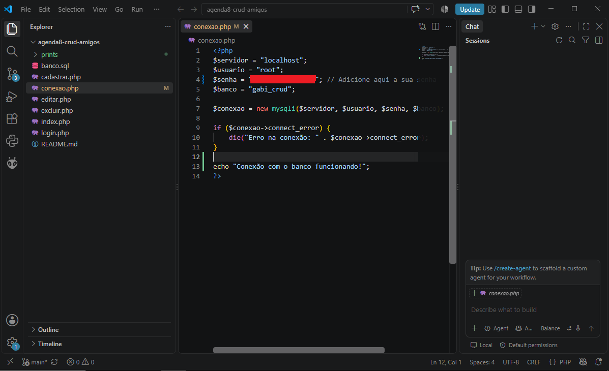

> A senha utilizada no ambiente local foi censurada no print e não é armazenada no repositório.
```

## 3. Servidor PHP

Abra o terminal na pasta do projeto e execute:

```powershell
php -S localhost:8000
```

Depois acesse:

```text
http://localhost:8000/login.php
```

---

# Testes realizados

Durante o desenvolvimento foram testados:

- Criação do banco de dados
- Conexão entre PHP e MySQL
- Cadastro de amigos
- Consulta de registros
- Edição
- Exclusão
- Confirmação antes da exclusão
- Prepared Statements
- Hash de senha
- Verificação de senha
- Login
- Controle por sessão
- Logout
- Estilização da interface com CSS

---

# Aprendizados

O desenvolvimento desta atividade ajudou a compreender melhor a relação entre uma aplicação PHP e um banco de dados MySQL.

O PHP funciona como intermediário entre a interface apresentada ao usuário e o banco de dados, enviando comandos SQL e utilizando os resultados retornados pelo MySQL.

Também foi possível aplicar conceitos de segurança que foram aparecendo durante as atividades, como Prepared Statements, `htmlspecialchars()`, hash de senhas e controle de acesso através de sessões.

A construção do CRUD permitiu visualizar na prática como as operações de criar, consultar, editar e excluir registros fazem parte de um sistema de cadastro.

---

## Autor

Pedro Akio Sakuma